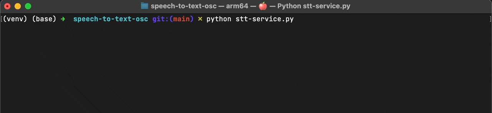

# Speech to Text Whisper OSC

This application is designed to transcribe speech to text using the Whisper ASR (Automatic Speech Recognition) model and
send the transcribed text to an OSC (Open Sound Control) server. It provides various options to configure the
transcription process and OSC communication.



### Installation

Create a virtual environment for python (version `>=3.8`) and install the requirements. Currently, the audio part only
supports MacOS and Windows.

```
pip install -r requirements.txt
```

Please check the [installation readme](https://people.csail.mit.edu/hubert/pyaudio/#downloads) for pyaudio, if you
experience problems with pyaudio.

### Usage

Start the service by running the script.

```
python stt-service.py
```

### Options

- `--model`: Specify the Whisper model to use. You can choose from "tiny," "base," "small," "medium," or "large."

- `--language`: Set the language code for speech decoding in ISO 639-1 format.

- `--backend`: The backend to be used for inference. You can choose
  from "[openai](https://github.com/openai/whisper)", "[faster](https://github.com/guillaumekln/faster-whisper)"
  and "[cpp](https://github.com/aarnphm/whispercpp)".

- `--energy-threshold`: Define the energy level for the microphone to detect. Default is `1000`.

- `--record-timeout`: Set the real-time recording duration in seconds. Default is `0.5`.

- `--phrase-timeout`: Specify the empty space duration between recordings before the message is sent. Default is `1.2`.

- `--osc-server`: Provide the IP address of the OSC server. Default is `"127.0.0.1."`

- `--osc-port`: Set the OSC output port. Default is `8000`.

### OSC Addresses and Values

This application sends OSC messages to communicate the recognized speech. The OSC addresses used are:

- `/stt/partial-text`: OSC address for partial transcriptions. Messages sent when text is recognized in realtime.
    1. `index`: An integer representing the index of the current sentence.
    2. `timestamp`: An string representing the start timestamp of the current sentence (ISO 8601 - local-timezone).
    3. `text`: A string containing the recognized partial text.

- `/stt/text`: OSC address for full transcriptions. Messages sent when a complete sentence or phrase is recognized.
    1. `index`: An integer representing the index of the current sentence.
    2. `timestamp`: An string representing the start timestamp of the current sentence (ISO 8601 - local-timezone).
    3. `text`: A string containing the recognized partial text.

### About

The code is inspired
by [davabase/whisper_real_time](https://github.com/davabase/whisper_real_time/blob/master/transcribe_demo.py)
